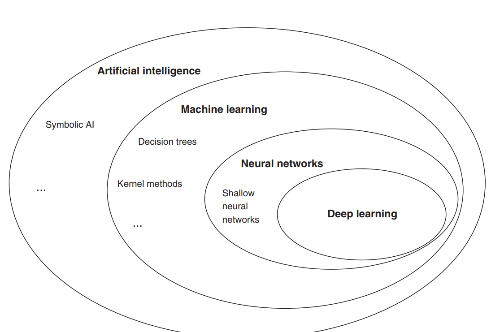

# Machine Learning, Deep Learning, and Artificial Intelligence

We live in a moment when terms like **Artificial Intelligence**, **Machine Learning**, and **Deep Learning** are everywhere. Whether on LinkedIn posts, articles, or products on the market, it is common to see these phrases without a clear sense of what they actually mean.

The goal of this material is to **demystify these concepts**, showing that they are more approachable than they sound and explaining how they apply, especially in **software development and web development**.

---

# What Is Artificial Intelligence?

**Artificial Intelligence (AI)** is a broad area of computing whose aim is to **automate intellectual tasks that would normally be performed by humans**.

In general, we can define AI as:

> The effort to build systems that can perform tasks that would normally require human intelligence.

Such tasks include:

- Image recognition
- Natural language processing
- Decision-making
- Planning
- Recommender systems

AI encompasses many approaches and techniques, including:

- **Machine Learning**
- **Neural networks**
- **Deep Learning**
- Rule-based systems

Historically, many AI systems did not learn from data. A classic example is **early chess programs**, which relied on **rules hand-coded by developers**.

Those systems **did not learn from data**; they only followed explicit rules.

---



---

Despite a name that suggests something like human intelligence, AI **does not literally replicate the human brain**.

Terms such as:

- neurons
- neural networks
- layers

are **metaphors inspired by biology**, but in practice AI systems are **mathematical and statistical models**.

In simplified form:

> Artificial Intelligence is any system that can learn patterns from data to perform a task.

When we talk about systems that learn from data, we are entering the field of **Machine Learning**.

---

# Machine Learning: the heart of modern AI

**Machine Learning (ML)** is a subfield of Artificial Intelligence focused on algorithms that can **find patterns in data and make predictions or decisions automatically**.

Instead of writing rules by hand to solve a problem, in Machine Learning:

1. We provide **data**
2. The algorithm **learns patterns**
3. The model **makes predictions on new data**

It helps to separate **algorithm** and **model**: the algorithm is the **method** (mathematical rules and optimization) that walks the data to adjust parameters; the **model** is the **artifact produced by training** — a function (or parameterized structure) that takes new inputs and outputs predictions without redoing the full learning process.

This paradigm makes systems:

- more **flexible**
- more **adaptable**
- more **scalable**

Today, Machine Learning appears in countless applications, such as:

- recommender systems (Netflix, Spotify, Amazon)
- spam filters
- virtual assistants
- face recognition
- search engines

---

# Types of learning in Machine Learning

## 1. Supervised Learning

This is currently the **most common** type of learning.

In this setting, the algorithm learns from **labeled data**: each example has a **known correct answer** associated with it.

The model’s goal is to learn the relationship between **inputs and outputs** so it can predict outcomes on new data.

### Regression

Used when we want to predict **continuous values**.

Classic example:

- predict a **house price** from:
  - size
  - location
  - number of bedrooms

The algorithm learns a function that fits the data and supports estimating future values.

---

### Classification

Used when the outcome is **discrete (categories)**.

Example:

- determine whether a tumor is:
  - **benign**
  - **malignant**

Here the model seeks a **decision boundary** that separates the classes.

---

### Technical note: Support Vector Machines (SVM)

**Support Vector Machines (SVM)** are classification algorithms that can use the so-called **kernel trick**.

That technique lets the algorithm **operate in extremely large feature spaces — even infinite-dimensional ones — in a computationally efficient way**.

---

## 2. Unsupervised Learning

In this type of learning, the data **has no labels**.

The algorithm’s goal is to **discover hidden patterns or structure in the data**.

---

### Clustering

The algorithm groups similar data automatically.

Example:

**Google News** can cluster thousands of stories on the same topic even without explicit information about which article belongs to which category.

---

### Cocktail party problem

The **cocktail party problem** is the challenge of separating different sound sources from a **single recording**.

For example:

- separating **one person’s voice**
- from **background music**

Algorithms such as **Independent Component Analysis (ICA)** are used for this kind of problem.

---

## 3. Reinforcement Learning

**Reinforcement Learning** is built on **rewards and penalties**.

An agent interacts with an environment and learns by trial and error.

The process works like this:

1. The agent takes an action
2. The environment returns a reward or penalty
3. The agent adjusts its strategy to maximize future rewards

Examples:

- robot control
- games
- autonomous vehicles

In many cases, **there is no single immediately “correct” answer**, but rather a sequence of actions that leads to a final goal.

Some problems are framed as **semi-supervised learning**: you combine a large amount of **unlabeled** data with a smaller **labeled** subset, sitting between fully supervised and unsupervised settings.

---

# Machine Learning engineering vs. “black magic”

Andrew Ng argues that building Machine Learning systems **should not be random trial and error**.

It should be treated as **structured engineering**.

A common approach is **error analysis** to determine whether the issue lies in:

- **data quantity**
- **data quality**
- **algorithm choice**
- the need for **more compute**

That strategy focuses engineering effort and avoids months of work on approaches that will not materially improve the model.

---

# The Deep Learning revolution

The **Deep Learning revolution** refers to the major rise of **deep neural networks** starting around **2012** and continuing to this day.

That progress rested on three main factors:

- more **data** available
- more **computing power (GPUs)**
- better **techniques for training neural networks**

Since then, deep neural networks have been applied across a wide range of problems, including:

- computer vision
- speech recognition
- natural language processing
- recommender systems
- autonomous vehicles

In many cases, these networks made it possible to solve problems that had seemed nearly impossible for machines.

---

# What is Deep Learning?

**Deep Learning** is a **subfield of Machine Learning** based on **deep artificial neural networks**.

The core idea is to stack many layers of artificial neurons so the model can learn **increasingly abstract representations of the data**.

For example, in an image recognition system:

1. Early layers detect **edges**
2. Middle layers detect **shapes**
3. Deep layers detect **whole objects**

That enables complex tasks such as:

- image recognition
- speech recognition
- machine translation
- text generation
- autonomous vehicles

---

Although it is technically a subfield of Machine Learning, **Deep Learning has drawn outsized attention because of its recent impact on industry and AI research**.

A classic example from Deep Learning studies is a system that can **learn to drive a car by watching a human drive**, using neural networks to learn directly from visual data.

---

# Neural networks

An **artificial neural network (ANN)** is a mathematical model made of many simple units — **artificial neurons** — connected to one another. Each connection has a **weight** that the algorithm **adjusts during training** using data, so the network maps inputs (for example, image pixels) to useful outputs (for example, “this is a cat” or “turn left”).

---

## From a neuron to a network

A typical neuron combines several **inputs**, multiplies each by its **weight**, sums them (often adding a **bias** that shifts the decision), and passes the result through an **activation function**. That function introduces **nonlinearity**: without it, stacking layers would not add expressive power — it would reduce to a single linear transformation.

---

## Layers: input, hidden, and output

Networks are organized in **layers**:

- The **input layer** receives raw data.
- **Hidden layers** turn that data into intermediate representations — the same “edges → shapes → objects” idea we saw in computer vision.
- The **output layer** produces the task result (classes, continuous values, probabilities, and so on).

When there are **many** hidden layers, we are in **Deep Learning** territory: the model is “deep” in the number of successive transformations.

---

## How a network learns (overview)

Training usually follows this idea: compare the network’s **prediction** to the **desired answer** (in supervised problems), measure the **error**, and **update weights** to reduce it. In practice, optimization algorithms such as **gradient descent** (and variants) indicate how to change each weight.

The classic mechanism for propagating those updates through all layers is **backpropagation**: the error is computed at the output and flows “backward” through the network to update weights and biases in a coordinated way. You do not need to master the formulas to grasp its role — only that **it is what makes learning at depth computationally practical**.

---

## How this fits software and web work

In practice you rarely code backpropagation by hand; libraries such as **TensorFlow.js** handle architecture, gradients, and numeric acceleration. The next section summarizes **what** that stack provides and **how** it fits the flow: data, training, evaluation, and production deployment.

---

# TensorFlow.js and ML in the browser

**TensorFlow.js** is an **open source** JavaScript library from Google, a **companion** to TensorFlow in Python. It supports ML workflows in the **browser** or **Node.js** — for example, a user can interact with a model by opening a web page, often **without installing** extra drivers or desktop apps.

---

## Layer API, low-level API, and backends

For training and inference, the library traditionally uses **WebGL** in the browser to accelerate numeric work. It offers a **high-level layer API** to define models declaratively and a **low-level API** centered on **linear algebra** over tensors (with roots in the earlier *deeplearn.js* project). You can often **import** models trained elsewhere (for example, TensorFlow or Keras workflows) when the format and version match the conversion and loading tools you use.

---

## Tensors: the core data structure

At the center of the API are **tensors**: blocks of data arranged as **multidimensional arrays** (numeric values or other supported types). Properties you see in nearly every example:

- **rank**: number of dimensions;
- **shape**: size along each dimension (for example, `[batch, height, width, channels]`);
- **dtype**: value type (many tutorials default to `float32`).

You create tensors from JavaScript arrays with `tf.tensor`; helpers such as `tf.tensor1d` through `tf.tensor6d` make the dimensionality explicit. Operations are usually **immutable**: adding or transforming tensors **returns new** tensors instead of mutating the originals.

---

## Memory in the browser

Tensors may live in accelerated buffers (for example on the GPU via WebGL); keeping tensors around without releasing them can **silently grow memory use**. The API provides `dispose()` (or `tf.dispose`) to free a tensor and `tf.tidy()` to run a block of operations and **keep only the final result**, disposing intermediates:

```js
const y = tf.tidy(() => a.square().neg());
```

---

## Three ways to work with the library

A simple way to organize the ecosystem (as in introductory TensorFlow.js material) is three levels of effort:

1. **Pre-trained model**: load a model already trained for a specific task and run **inference** only in the client or on Node.
2. **Transfer learning**: start from an existing model and **retrain** (or freeze layers and train a new head) on your domain data.
3. **Build, train, and predict in JavaScript**: define architecture, the training loop, and evaluation **entirely in JS** — useful for prototypes, teaching demos, and products with privacy or client-side latency needs.

In every case, the product flow stays **data → training (when needed) → validation → deployment and monitoring**.

---

## Going deeper with TensorFlow.js books

*Deep Learning with JavaScript* (from authors closely tied to TensorFlow, Manning) starts from similar motivations and goes deeper on **training in the web ecosystem**, preparing and transforming data, visualizing metrics, and **generalization** — especially **underfitting** and **overfitting** — i.e., whether the model works on new data, not just the training set.

---

## Suggested readings

- Gerard, Charlie. *Practical Machine Learning in JavaScript: TensorFlow.js for Web Developers*. Apress, 2021. ISBN 978-1-4842-6417-1.
- Cai, Shanqing; Bileschi, Stan; Nielsen, Eric; Chollet, François. *Deep Learning with JavaScript*. Manning — strong follow-on for TensorFlow.js, training workflow, and practice once you have the PDF handy.
